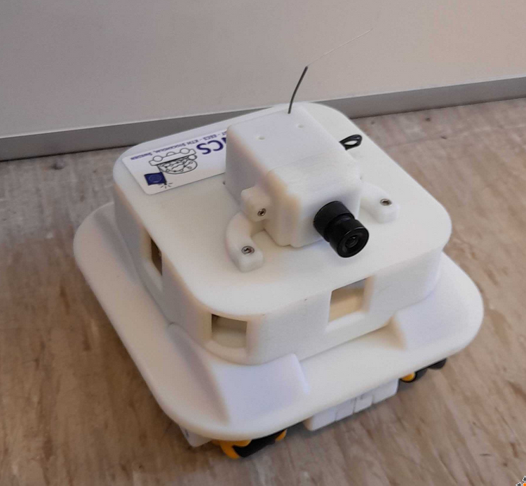

# Durin

Durin is a wheeled robot developed at KTH for the neurocomputing science department

uses platformio to build

See https://github.com/ncskth/durin for the official high-level API

## configuration
`durin_configurator/durin_configurator.py` is used to configure and send simple commands. Just run it with `-h` until I got time to write better documentation